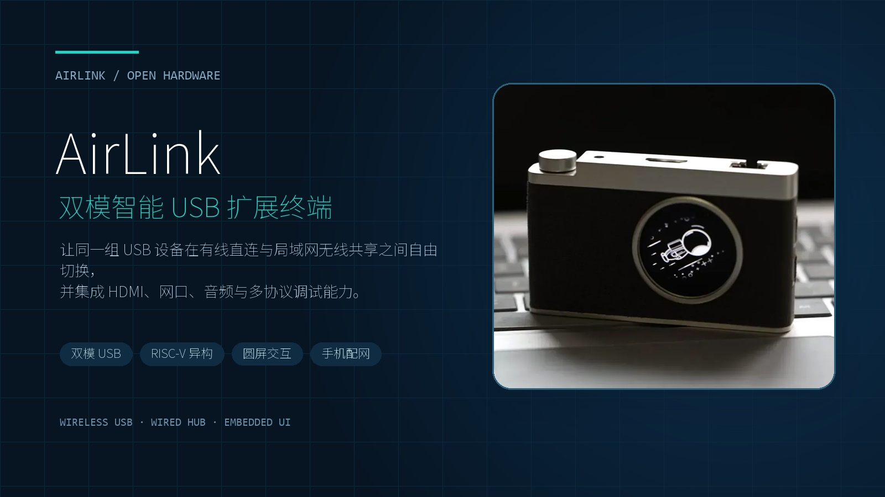

[�S-�](README.zh-CN.md) | **English**

# AirLink SG2002

Current public firmware: **V2.0.0** (internal build R27.6.6.23).

AirLink is a dual-mode USB expansion and USB-over-IP terminal based on the
SG2002. In wired mode the host PC owns the USB hub. In wireless mode Linux
shares USB devices over Wi-Fi through VirtualHere. A C906L bare-metal firmware
keeps the 240�240 display, touch input, battery ADC and CH347 controls responsive
independently from Linux startup.



## Highlights

- Wired USB hub with HDMI, Ethernet and 3.5 mm audio.
- 2.4/5 GHz Wi-Fi provisioning through a captive portal.
- VirtualHere USB sharing with real listener/client state reporting.
- Four local CH347 modes: dual UART, SPI/I�C, HID SPI/I�C and JTAG/UART.
- C906L LVGL UI using a 46.875 MHz GC9A01 SPI clock.
- AIC8800 SDIO requests 50 MHz and runs at approximately 46.875 MHz.
- IPC protocol v1, ABI4, C906L firmware R27P and Linux firmware LN27.

## Download and flash

Download the release assets from the repository **Releases** page:

```text
Airlink-V2.0.0.img
SHA256SUMS
manifest.json
```

Verify on Linux/WSL:

```bash
sha256sum -c SHA256SUMS
```

Flash the resulting `.img` with balenaEtcher, Rufus or Win32 Disk Imager.
Writing an image erases the selected storage device.

## Build from source on Windows WSL2

Requirements:

- Windows 10/11 with WSL2.
- Ubuntu 22.04.
- At least 8 GB RAM and 80 GB free disk space.
- A stable network connection for Ubuntu packages and the SG2002 host tools.

Install WSL2 from an Administrator PowerShell window:

```powershell
wsl --install -d Ubuntu-22.04
wsl --set-version Ubuntu-22.04 2
```

Open Ubuntu 22.04 and run:

```bash
sudo apt-get update
sudo apt-get install -y ca-certificates git make python3

git clone https://github.com/LX-DMT/AirLink.git
cd AirLink

make doctor
make bootstrap
make release
make verify
```

Expected final output:

```text
AirLink release verification: PASS
out/release/Airlink-V2.0.0.img
```

The first full SDK build can take one to several hours. Do not build inside
`/mnt/c`; keep the repository in the WSL Linux filesystem.

See [the detailed WSL2 build guide](docs/en/build-wsl2.md) for expected output
and troubleshooting.

## First use

In wireless mode, connect the phone to `AirLink-XXXX` with password
`12345678`, then use the captive portal to select the target Wi-Fi. Install
VirtualHere Client on a computer in the same LAN. Detailed provisioning,
VirtualHere and CH347 instructions are in the [user guide](docs/en/user-guide.md).

## Documentation

- [User guide](docs/en/user-guide.md)
- [Software architecture](docs/en/architecture.md)
- [WSL2 build guide](docs/en/build-wsl2.md)
- [Image layout](docs/en/image-layout.md)
- [Troubleshooting](docs/en/troubleshooting.md)
- [Clean WSL2 validation](docs/en/clean-wsl-validation.md)
- [Release process](docs/en/release-process.md)
- [Chinese documentation](README.zh-CN.md)

## Licensing

AirLink-authored code under `airlink/` and AirLink build scripts are provided
under Apache-2.0. The integrated SG2002 SDK remains under its original
component-specific licenses.

VirtualHere is proprietary software, is not covered by Apache-2.0 and is bundled
with its original proprietary notices. See
[THIRD_PARTY_NOTICES.md](THIRD_PARTY_NOTICES.md).
