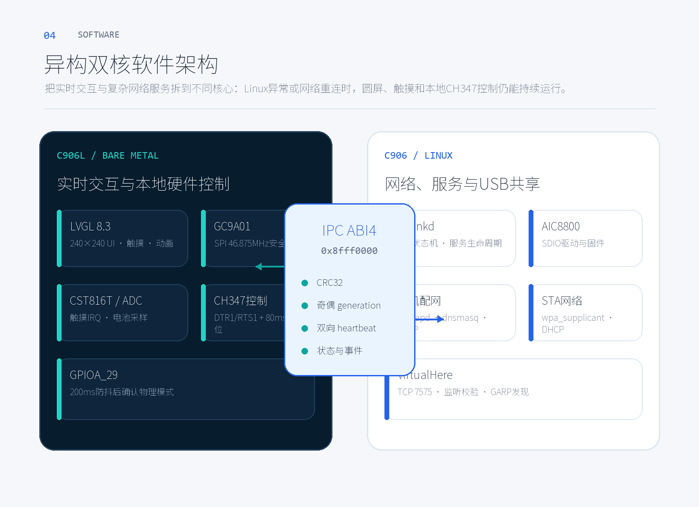

# AirLink软件架构

## 1. 总体结构

AirLink同时使用SG2002的两个RISC-V核心：

- **C906L裸机侧**：圆屏、触摸、电池ADC、GPIOA_29和CH347本地控制；
- **C906 Linux侧**：Wi-Fi、DHCP、手机配网、VirtualHere和诊断接口。

C906L不依赖Linux调度，因此Linux尚未启动、正在切换网络或服务重启时，屏幕、
触摸、电压显示和CH347仍能运行。两核仅通过保留共享内存交换经过版本和CRC校验的
状态/命令，不共享用户Wi-Fi密码。



## 2. 启动流程与双核分工

上电后的关键顺序如下：

```text
BootROM
→ FSBL/BL2初始化DDR和时钟
→ OpenSBI/U-Boot加载Linux FIT
→ BLCP_2ND启动C906L裸机固件
→ Linux Kernel、DTB和ramdisk启动
→ udev与AIC8800模块加载
→ S29airlinkd启动并完成IPC握手
→ 根据GPIOA_29进入有线或无线状态机
```

C906L固件由FIP中的`BLCP_2ND`承载，运行地址为`0x8fe00000`。Linux Kernel、
DTB和ramdisk位于`boot.sd` FIT中。两者可独立重新构建，最终由镜像组装脚本放入
FAT16启动分区。

## 3. C906L固件

C906L固件标识为`R27P`，主要模块包括：

- `display.c`：GC9A01初始化、窗口设置和SPI刷新；
- `touch.c`：CST816T读取、滑动、点击和防抖；
- `adc1.c`：16次去极值平均、最近三批中值滤波和四格电池显示；
- `ch347.c`：MODE0–3、DTR1/RTS1控制和80ms非阻塞复位；
- `airlink_ui.c`：有线/无线主页、配网提示、引脚页和30秒屏保；
- `ipc_smoke.c`：共享内存初始化、CRC、generation、心跳和命令队列。

显示使用单个`240×240 RGB565`全屏缓冲。页面滑动使用20ms节拍和240ms动画，
局部转圈使用16ms节拍，屏保使用33ms节拍。全屏缓冲将一次页面刷新合并为一次
flush，减少四条60行缓冲造成的提交间隙和残影。

## 4. Linux用户态

`airlinkd`是C11守护进程，统一拥有以下资源：

- `wlan0`、`wpa_supplicant`和BusyBox `udhcpc`；
- `hostapd`、`dnsmasq`和内置Captive Portal；
- VirtualHere服务进程、TCP 7575监听和电脑连接检测；
- GPIOA_29模式输入、共享内存IPC和`/run/airlinkd.sock`；
- `airlinkctl status/diag/wifi forget`管理接口。

Linux固件标识为`LN27`。Release只保留串口root和`airlinkctl`，不启动SSH、
Telnet或adbd。STA密码只存在于权限为0600的配置文件和临时进程输入中，不进入
IPC、日志、状态JSON、诊断包或圆屏。

## 5. IPC协议v1 ABI4

IPC公共定义位于`airlink/ipc/airlink_ipc_v4.h`。共享区总布局大小为`0x380`，
包括：

- 双向消息环；
- 命令结果区；
- Linux状态快照；
- 128字节配网状态块；
- 版本、固件ID、CRC32、generation和心跳字段。

写入方先更新奇数generation，再写负载和CRC，最后发布偶数generation；读取方
只有在两次generation一致、为偶数且CRC正确时才接受快照。Linux启动时必须验证
对端为`R27P`和ABI4，成功日志为：

```text
IPC peer=R27P abi=4 PASS
SELFTEST PASS
```

未知ABI或固件ID不匹配时`airlinkd`拒绝继续控制硬件，避免两侧按不同结构解释
共享内存。

## 6. GPIOA_29模式状态机

GPIOA_29经过200ms稳定防抖后决定产品模式。状态变化立即通知C906L首页，同时
Linux在后台切换服务：

```text
有线：
MODE_SWITCHING
→ 批量停止hostapd/dnsmasq/wpa_supplicant/udhcpc/VirtualHere
→ WIRED_READY

无线：
MODE_SWITCHING
→ 加载并准备wlan0
→ WIRELESS_WAIT_LINK 或 WIRELESS_PROVISIONING
→ 连接Wi-Fi并启动VirtualHere
```

UI不再使用全屏阻塞页。C906L先返回对应首页，再以内联转圈和真实状态文字表示
Linux进度。有线切换会强制关闭配网页和清理旧会话显示状态。

## 7. 手机配网与Captive Portal

未保存Wi-Fi时自动进入配网；用户也可从Wi-Fi页重新配置。热点固定为：

```text
SSID: AirLink-XXXX
Password: 12345678
Address: 192.168.4.1/24
Channel: 1, 20 MHz
Security: WPA2-CCMP
```

`XXXX`来自稳定设备MAC后四位。配网状态机为：

```text
IDLE → SCANNING → AP_STARTING → AP_READY
→ SUBMITTED → STA_TESTING → SUCCESS
或 FAILED → 恢复AP
```

内置非阻塞HTTP服务器提供`/api/networks`、`/api/status`、
`/api/provision`和`/api/cancel`，并响应Android、iOS、Windows的常见
Captive Portal探测地址。提交后先HTTP返回，再关闭AP测试STA；只有取得IPv4后
才原子保存候选配置。失败不覆盖旧配置。

## 8. Wi-Fi与VirtualHere生命周期

AIC8800驱动请求50MHz SDIO，SG2002分频后实测约46.875MHz。每次STA启动或重连
都会执行`iw dev wlan0 set power_save off`。VirtualHere不会在刚拿到地址时
立即启动，而是依次等待：

```text
wlan0已关联
→ 获得真实IPv4
→ 存在wlan0默认路由
→ 上述条件连续稳定2秒
→ 启动VirtualHere
```

`virtualhere_state`语义：

- 0：未启动；
- 1：TCP 7575已监听，等待电脑；
- 2：电脑TCP连接稳定建立。

电脑未连接不是系统故障。连续三次真实启动失败后才发布无线服务异常；监听30秒
仍无客户端时诊断仅提示检查电脑网络或AP隔离。

## 9. CH347本地切换

CH347由C906L直接控制，不等待Linux、Wi-Fi或VirtualHere：

```text
选择MODE0–3
→ 设置DTR1/RTS1
→ 拉低RST# 80ms
→ 释放复位
→ 回读锁存状态
→ 更新当前模式和UI
```

切换状态机使用generation去重，触摸连续事件不会重复触发复位。引脚参考页只显示
当前实际模式，不写GPIO、不发送IPC，也不会主动触发USB重新枚举。

## 10. 显示、SDIO与时钟

- GC9A01 SPI请求50MHz，实际46.875MHz；
- AIC8800 SDIO请求50MHz，实际46.875MHz；
- Wi-Fi RF信道带宽与SDIO总线频率是两个独立概念；
- Captive Portal热点使用2.4GHz信道1、20MHz带宽；
- 页面动画以物理全屏传输上限约48–50FPS为目标，不宣称60FPS。

## 11. RootFS、FIP与整镜像关系

统一构建流程如下：

```text
airlink/c906l源码 → r26-lvgl.bin → FIP BLCP_2ND
airlink/linux源码 → airlinkd/airlinkctl → Release RootFS
Linux源码 + DTS → Kernel/DTB → boot.sd FIT
ramdisk + Buildroot + osdrv → SDK RootFS和驱动
FIP + boot.sd + Release RootFS → 1.58GiB SD镜像
```

Release组装会删除Python、Qt、OpenCV、FFmpeg、开发库、调试工具和旧服务，
执行ELF依赖闭包检查，然后生成MBR、16MiB FAT16启动分区和1600MiB ext4
RootFS分区。镜像验证会从最终镜像重新读回FIP、FIT、DTB、RootFS关键程序和
AIC8800模块并比较哈希。

## 12. 故障隔离与安全边界

- C906L UI故障不会修改Linux Wi-Fi配置；
- Linux IPC握手失败时不继续发送硬件控制命令；
- 配网失败保留旧网络并恢复热点；
- GPIOA_29切有线时终止配网和无线进程；
- CH347切换允许中断正在使用的USB连接，但不会等待Linux确认；
- Release网络监听只允许配网期DHCP/DNS/HTTP和无线共享期VirtualHere；
- 最终Release必须由全新WSL构建并通过实机验收后才能公开。
